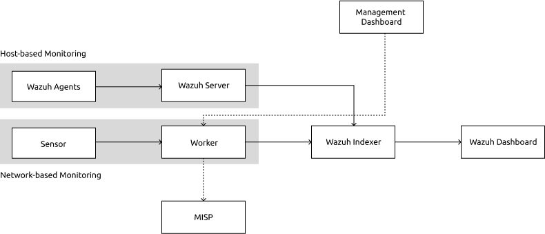

# Network Monitoring Platform Documents

## System Archtecture

## Suggested Installation Order
1. [OpenSearh](https://opensearch.org/docs/latest/install-and-configure/install-opensearch/index/) or [Wazuh Platform](https://documentation.wazuh.com/current/index.html)  (if you want to use Wazuh SIEM for Host-based IDS)
2. [MISP](https://www.misp-project.org/download/)
3. MySQL
4. [Network Monitoring Dashboard](https://github.com/SMC-Security-Team/security-dashboard)
5. [Network Monitoring Worker](https://github.com/SMC-Security-Team/security-worker)
6. [Network Monitoring Sensor](https://github.com/SMC-Security-Team/security-sensor)
